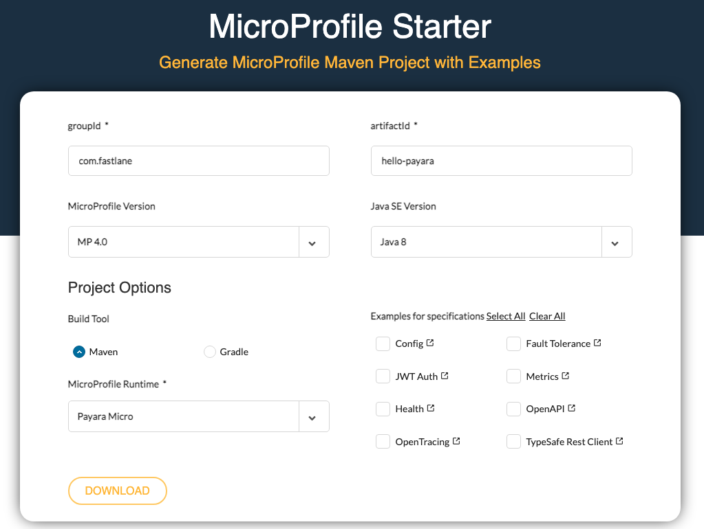
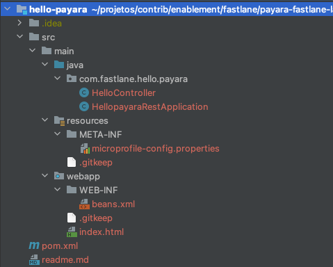

# Getting started with Payara Micro

In this lab, you will use the microprofile starter to generate your first Microprofile application, using Payara Micro as the runtime. 

1. Access the page [https://start.microprofile.io/](https://start.microprofile.io/)





2. Insert the data:

   * groupId: com.fastlane
   * artifactId: hello-payara
   * MicroProfile Version: 4.0
   * Build Tool: Maven
   * MicroProfile Runtime: Payara Micro

3. Click on download. You will get a zip file with an automatically generated project for you to get started. 

4. Unzip the file `hello-payara.zip`. You should have a project similar to:

   

   

5. Explore the classes and check what is available out of the box, when we don't select any extra features in the starter page.

6. Open the terminal and access the project's folder. 

7. Run the following maven command. Maven will download the dependencies described in the project's `pom.xml` file. It will also create an executable jar we can use to access our application: `hello-payara-microbundle.jar`.

   ```shell
   $ mvn clean package
   ```

7. Now, let's start our first Payara Micro application. In your terminal, run the following command:

   ```bash
   java -jar -Djava.net.preferIPv4Stack=true target/hello-payara-microbundle.jar
   ```

8. If everything goes well, you should see an output similar to: 

   ```
   [2021-10-11T17:07:15.442-0300] [] [INFO] [] [PayaraMicro] [tid: _ThreadID=1 _ThreadName=main] [timeMillis: 1633982835442] [levelValue: 800] [[
   
   Payara Micro URLs:
   http://karinas-mbp.box:8080/
   
   'ROOT' REST Endpoints:
   GET	/data/application.wadl
   GET	/data/hello
   GET	/openapi/
   GET	/openapi/application.wadl
   
   ]]
   
   [2021-10-11T17:07:15.442-0300] [] [INFO] [] [PayaraMicro] [tid: _ThreadID=1 _ThreadName=main] [timeMillis: 1633982835442] [levelValue: 800] Payara Micro  5.2021.1 #badassmicrofish (build 2818) ready in 8,526 (ms)
   ```

9. In your browser, you can access the page [http://localhost:8080/data/hello](http://localhost:8080/data/hello). 

10. Question: What are the classes that are responding to this request? 

11. Try changing the message that is displayed in this page. Package your application again, and start it using Java, like we did on steps 6 and 7. 

# Congratulations!

You've successfully created, packaged, changed and accessed an application based on the MicroProfile specification and that runs with the Payara Micro runtime!